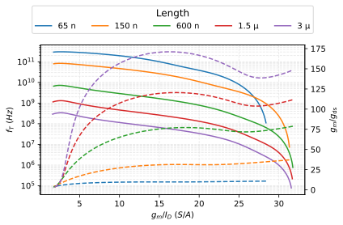
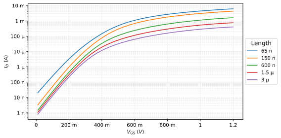
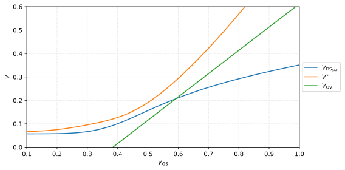

# MOSFET Characterization in Python

## Introduction

This tool does three things:

1. Generate lookup tables of MOSFET parameters.

2. Make plots of MOSFET parameters.

3. Optimize analog circuits.


## Installation

### Requirements

- Python (3.9+ recommended)

- numpy, scipy, matplotlib

Also install a SPICE simulator such as [ngspice](https://ngspice.sourceforge.io/) or hspice to generate lookup tables.

### Steps

- Clone the repository:

```bash
git clone https://github.com/medwatt/gmid.git
```

- Install the package:

```bash
pip install .
```

## Generating a Lookup Table

Before plotting, create a lookup table with all the MOSFET parameters. This is
done in three steps.

### Simulation Definition

An example of how to create an ngspice/hspice simulator instance is shown
below.

```python
from mosplot.lookup_table_generator.simulators import NgspiceSimulator, HspiceSimulator

# One of `include_paths` or `lib_mappings` must be specified.
# The rest are optional.

ngspice = NgspiceSimulator(
    # Provide path to simulator if simulator is not in system path.
    simulator_path="ngspice",

    # Default simulation temperature. Override if needed.
    temperature=27,

    # All parameters are saved by default. Override if needed.
    parameters_to_save=["id", "vth", "vdsat", "gm"],

    # Files to include with `.INCLUDE`.
    include_paths=[
        "./NMOS_VTH.inc",
        "./PMOS_VTH.inc"
    ],

    # Files to include with `.LIB`.
    lib_mappings = [
        ("/tools/pdk/models/hspice/models/design_wrapper.lib", "tt_pre")
    ],

    # If the transistor is defined inside a subcircuit in
    # the library files, you must specify the symbol used (first entry)
    # and the hierarchical name (second entry). Override if needed.
    mos_spice_symbols = ("x1", "x1.main"),

    # Additional spice code that may be needed for the simulation goes here:
    raw_spice = [
        "line 1",
        "line 2",
    ]

    # Specify the width. For devices that do not take a width,
    # you can specify other parameters such as the number of fingers.
    # The keys are exactly those recognized by the model.
    device_parameters = {
        "w": 10e-6,
    }
)
```

### Sweep Parameters

Specify the sweep ranges for the transistors.

```python
from mosplot.lookup_table_generator import TransistorSweep

# Define a sweep object for NMOS transistors.
nmos_sweep = TransistorSweep(
    mos_type="nmos",
    vgs=(0, 1.0, 0.01),
    vds=(0, 1.0, 0.01),
    vbs=(0, -1.0, -0.1),
    length=[45e-9, 100e-9]
)

# Define a sweep object for PMOS transistors.
pmos_sweep = TransistorSweep(
    mos_type="pmos",
    vgs=(0, -1.0, -0.01),
    vds=(0, -1.0, -0.01),
    vbs=(0, 1.0, 0.1),
    length=[200e-9, 500e-9]
)
```

### Lookup Table Builder Setup

Now that we have the `ngspice` simulator object and `nmos_sweep` and
`pmos_sweep` objects, we can generate the lookup table.

```python
from mosplot.lookup_table_generator import LookupTableGenerator

obj = LookupTableGenerator(
    description="freepdk 45nm",

    # Pass the simulator object
    simulator=ngspice,

    # Pass the sweep object, specifying the models they apply to.
    model_sweeps={
        "NMOS_VTH": nmos_sweep,
        "PMOS_VTH": pmos_sweep,
    },

    # Specify the number of processes to use to build the table faster.
    # Note: `ngspice` already applies parallel processing for certain
    # models. Setting `n_process` to values other than 1 may result in
    # slow downs.
    n_process=1,
)

# Optionally, run an op simulation to check outputs.
# obj.op_simulation()

# Build and store the table.
obj.build("./freepdk_45nm")
```

## Imports

```python
import numpy as np
from mosplot.plot import load_lookup_table, Mosfet, Expression
```

Load a lookup table:

```python
lookup_table = load_lookup_table("path/to/lookup-table.npz")
```

It is recommended to use this tool in a REPL-like environment to avoid
reloading the table every time.

The lookup table is just a Python dictionary:

```python
print(lookup_table.keys())

dict_keys(['nch_lvt', 'pch_lvt', 'width', 'description', 'simulator', 'parameter_names'])
```


## Making Simple Plots

Create a MOSFET instance:

```python
nmos = Mosfet(lookup_table=lookup_table, mos="nch_lvt", vbs=0.0, vds=0.6, vgs=(0.01, 1.10))
pmos = Mosfet(lookup_table=lookup_table, mos="pch_lvt", vbs=0.0, vds=-0.6, vgs=(-1.2, -0.01))
```

For the `nmos`, the above code filters the lookup table at `vbs=0.0` and
`vds=0.6` for `vgs` values between `0.01` and `1.2`. Since the length
is not specified, all lengths in the lookup table are used.

To print out all the lengths in the filtered table:

```python
print(nmos.length)

array([6.50e-08, 8.00e-08, 1.00e-07, 1.25e-07, 1.50e-07, 2.00e-07,
       3.00e-07, 4.00e-07, 6.00e-07, 8.00e-07, 1.00e-06, 1.25e-05,
       1.50e-06, 1.75e-06, 2.00e-06, 2.50e-06, 3.00e-06, 4.00e-06,
       5.00e-06])
```

To create a plot, use `plot_by_expression`. For example, to plot $I_{D}/W$
vs. $g_{m}/I_{D}$:

```python
nmos.plot_by_expression(
    x_expression = nmos.gmid_expression,
    y_expression = nmos.current_density_expression,
    filtered_values = nmos.length[0:-1:4],
    y_scale="log",
    save_fig="./figures/nmos_current_density.svg"
    # there are many other plot related options
)
```


Some common expressions include:

- `gmid_expression`

- `vgs_expression`

- `vds_expression`

- `vbs_expression`

- `gain_expression`

- `current_density_expression`

- `transist_frequency_expression`

- `early_voltage_expression`

To plot something custom, for example $V_{GS}$ on the x-axis and a custom
expression on the y-axis:

```python
nmos.plot_by_expression(
    x_expression = nmos.vgs_expression,
    y_expression = Expression(
        variables=["id", "gds"],
        function=lambda x, y: x / y,
        label="$I_D / g_{ds} (A/S)$",
    ),
    filtered_values = nmos.length[0:-1:4],
)
```


A second axis can also be plotted:

```python
nmos.plot_by_expression(
    x_expression = nmos.gmid_expression,
    y_expression = nmos.transist_frequency_expression,
    y2_expression = nmos.gain_expression,
    filtered_values = nmos.length[0:-1:4],
    y_scale="log",
    save_fig="/home/medwatt/git/gmid/figures/nmos_twin_plot.svg"
)
```



## Looking Up Values

You can also get raw values by interpolation. For example, to look up the gain
at a specific point:

```python
x = nmos.interpolate(
    x_expression=nmos.length_expression,
    x_value=100e-9,
    y_expression=nmos.gmid_expression,
    y_value=15,
    z_expression=nmos.gain_expression,
)
```

Or to get a 2D sweep:

```python
x = nmos.interpolate(
    x_expression=nmos.vdsat_expression,
    x_value=(0.08, 0.12, 0.01),
    y_expression=nmos.gds_expression,
    y_value=(1e-6, 4e-6, 1e-6),
    z_expression=nmos.gmid_expression,
)
```

To look up an expression without interpolation:

```python
x = nmos.lookup_expression_from_table(
    length=65e-9,
    vbs = 0,
    vds = (0.0, 1.2, 0.01),
    vgs = (0.0, 1.2, 0.2),
    primary="vds",
    expression=nmos.current_density_expression,
)
```

Here, `vgs` is assumed to be the secondary sweep variable since it is a
range. It could be omitted or set to `None` to use all the values stored in
the table.

## Plotting Methods

### Plot by Sweep

The `plot_by_sweep` method uses the full table instead of the filtered table.
Some usage examples are given below.

To plot the input characteristic of the `nmos`:

```python
nmos.plot_by_sweep(
    length=nmos.length[:-1:4],
    vbs = 0,
    vds = 0.6,
    vgs = (0.01, 1.2, 0.01),
    x_expression = nmos.vgs_expression,
    y_expression = nmos.id_expression,
    primary = "vgs",
    x_eng_format=True,
    y_eng_format=True,
    y_scale='log',
)
```



To plot the output characteristic of the `nmos`:

```python
nmos.plot_by_sweep(
    length=65e-9,
    vbs = 0,
    vds = (0.0, 1.2, 0.01),
    vgs = (0.0, 1.2, 0.2),
    x_expression = nmos.vds_expression,
    y_expression = nmos.id_expression,
    primary = "vds",
    x_eng_format=True,
    y_eng_format=True,
    y_scale='linear',
)
```


To plot the dependence of transistor speed and gain on the `length`:

```python
nmos.plot_by_sweep(
    length=nmos.length[1:],
    vbs = 0,
    vds = 1.2,
    vgs = (0.4, 1.2, 0.25),
    x_expression = nmos.length_expression,
    y_expression = nmos.transist_frequency_expression,
    y2_expression = nmos.gain_expression,
    primary = "length",
    x_eng_format=True,
    y_eng_format=True,
    y_scale="log",
    y2_scale="linear",
)
```


### Quick Plot

Combine data from multiple plots into one.

Get the data points:

```python
vdsat, vov, vstar = nmos.lookup_expression_from_table(
    length=100e-9,
    vbs=0,
    vds=0.6,
    vgs=(0.01, 1.2, 0.01),
    primary="vgs",
    expression=[
        nmos.vdsat_expression,
        Expression(
            variables=["vgs", "vth"],
            function=lambda x, y: x - y
        ),
        Expression(
            variables=["gm", "id"],
            function=lambda x, y: 2 / (x/y),
        ),
    ]
)
```

Combine the data points with `quick_plot`:

```python
x_values = np.arange(0.01, 1.2+0.01, 0.01) # don't forget to include the end point

nmos.quick_plot(
    x = [x_values, x_values, x_values],
    y = [vdsat, vstar, vov],
    legend = ["$V_{\\mathrm{DS}_{\\mathrm{SAT}}}$", "$V^{\\star}$", "$V_{\\mathrm{OV}}$"],
    x_limit = (0.1, 1),
    y_limit = (0, 0.6),
    x_label = "$V_{\\mathrm{GS}}$",
    y_label = "$V$",
    save_fig="./figures/nmos_vth_vs_length.svg"
)
```



## Optimization

You can optimize analog circuits using this tool. Define optimization
parameters and target specifications, then run the optimizer.

```python
from mosplot.optimizer import Optimizer, DesignReport
from datatypes import Spec, OptimizationParameter

parameters = [
    OptimizationParameter("L_input", (100e-9, 2e-6)),
    OptimizationParameter("gmid_input", (7, 16)),
    OptimizationParameter("L_load", (100e-9, 2e-6)),
    OptimizationParameter("gmid_load", (7, 15)),
    OptimizationParameter("L_tail", (100e-9, 2e-6)),
    OptimizationParameter("gmid_tail", (7, 15)),
    OptimizationParameter("Ibias", (1e-6, 40e-6))
]

target_specs = {
    "GBW":       Spec(5e6, "max", 5),
    "Gain":      Spec(30, "max", 2),
    "Ibias":     Spec(20e-6, "min", 1),
    "ICMR_LOW":  Spec(0.1, "min", 1),
    "ICMR_HIGH": Spec(0.7, "max", 5),
    "CMRR":      Spec(2000, "max", 3),
    "Area":      Spec(15e-12, "min", 1)
}
```

Create your circuit instance that defines how the specs are computed and run
the optimizer:

```python
circuit = Circuit(lookup_table, pmos_range, nmos_range, "pch_lvt", "nch_lvt", VDD, CL)
optimizer = Optimizer(circuit, parameters, target_specs)
optimizer.optimize(maxiter=5)

report = DesignReport(circuit, optimizer)
print("\nDesign Report:")
print(report.report())
```

## Acknowledgment

- HSPICE output parsing is based on [this script](https://github.com/HMC-ACE/hspiceParser) .

- If you find this tool useful, please cite it if you use it.

    ```{}
    @misc{medwatt_mosplot,
        author       = {Mohamed Watfa},
        title        = {{Mosplot: The MOSFET Characterization Tool}},
        month        = mar,
        year         = 2025,
        publisher    = {GitHub},
        journal      = {GitHub repository},
        howpublished = {\url{https://github.com/medwatt/gmid}},
        note         = {Accessed: 2025-03-31}
    }
    ```


